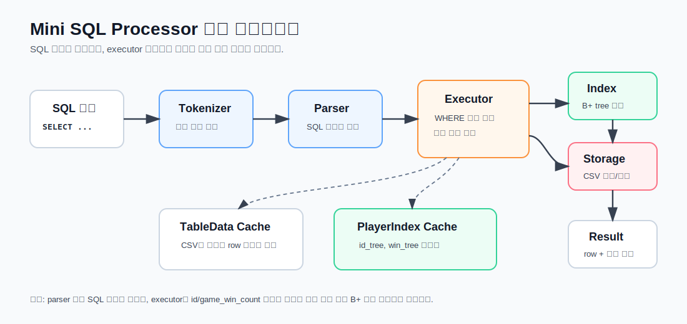
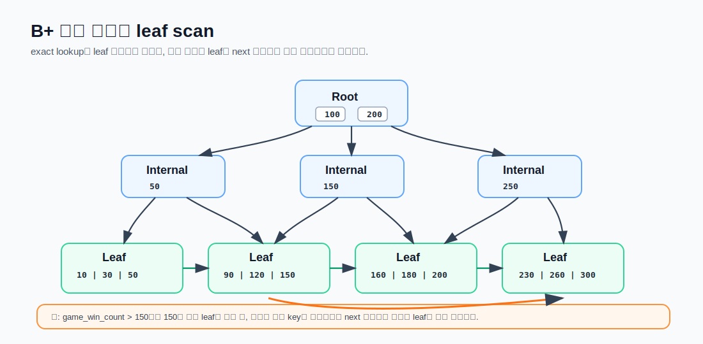
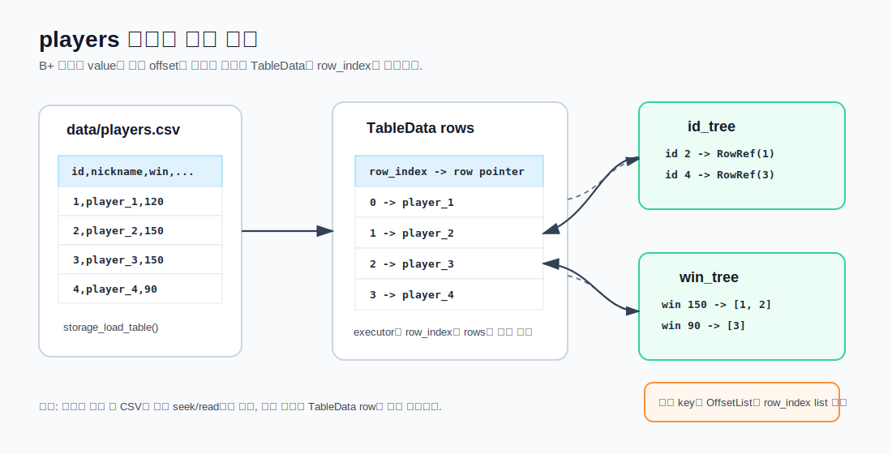

# Mini SQL Processor - B+ Tree Index

이 프로젝트는 C로 구현한 간단한 SQL 처리기입니다. 기존 `INSERT`, `SELECT`, `DELETE`, CSV 저장소, REPL/파일 실행 흐름을 유지하면서 이번 과제 범위인 **메모리 기반 B+ 트리 인덱스**를 추가했습니다.

이번 구현의 핵심은 SQL 처리 흐름 안에 B+ 트리 인덱스를 연결하는 것입니다.

- `id` 컬럼이 있는 테이블은 ID B+ 트리 인덱스를 사용할 수 있습니다.
- `game_win_count` 컬럼이 있는 테이블은 승리 횟수 B+ 트리 인덱스를 추가로 사용할 수 있습니다.

SQL 문법은 새로 만들지 않았습니다. 기존처럼 `SELECT ... WHERE column op value` 형태를 사용하고, executor가 조건을 보고 선형 탐색과 B+ 트리 조회 중 하나를 선택합니다. 데모에서는 `--compare-index` 옵션으로 같은 SELECT를 선형 탐색과 B+ 트리 방식으로 연속 실행해 비교합니다.

---

## 프로젝트 핵심

이 프로젝트는 완성형 DBMS를 만드는 것이 아니라, SQL 처리 흐름 안에 인덱스가 어떻게 들어가는지 확인하는 데 초점을 둡니다.

| 구분 | 내용 |
| --- | --- |
| 저장 방식 | `data/<table>.csv` 파일 기반 저장 |
| SQL 처리 | tokenizer, parser, executor 단계 분리 |
| 기존 조회 | WHERE 조건을 만족할 때까지 row를 순서대로 검사 |
| 개선 조회 | `id` 컬럼 B+ 트리, `game_win_count` 컬럼 보조 B+ 트리 적용 |
| 비교 방식 | `--compare-index`로 같은 SELECT를 선형 탐색과 B+ 트리로 연속 실행 |
| 관찰 지표 | 실행 계획, 결과 행 수, 검사 행 수, 강조 표시된 소요 시간 |

시각 자료:

| 자료 | 파일 |
| --- | --- |
| SQL 실행 파이프라인 | `docs/assets/sql_pipeline.svg` |
| `players` 인덱스 매핑 | `docs/assets/index_mapping.svg` |
| B+ 트리 leaf scan | `docs/assets/bptree_leaf_scan.svg` |

---

## 구현 목표

기존 구조에서 `SELECT ... WHERE ...` 조건은 테이블을 처음부터 끝까지 확인하는 선형 탐색 방식으로 처리했습니다. 선형 탐색은 단순하지만, 데이터가 100만 건 이상으로 늘어나면 조건에 맞는 row를 찾기 위해 많은 row를 검사해야 합니다.

이번 구현에서는 대용량 데이터에서 `id` 기준 조회를 빠르게 처리하기 위해 B+ 트리 인덱스를 추가했습니다.

| 조회 방식 | 탐색 방식 | 대표 조건 |
| --- | --- | --- |
| 선형 탐색 | 앞에서부터 row를 순서대로 검사 | `WHERE nickname = ?` |
| B+ 트리 인덱스 | 정렬된 key를 따라 leaf node까지 탐색 | `WHERE id = ?` |

`id`처럼 고유한 값을 기준으로 단건 조회를 할 때는 선형 탐색의 최악 시간복잡도 `O(n)`과 B+ 트리 탐색의 `O(log n)` 차이를 가장 분명하게 확인할 수 있습니다.

---

## 데모 데이터

발표 데모는 `players` 테이블을 비운 상태에서 시작한 뒤, 1,000,000건 INSERT를 직접 실행하는 흐름으로 진행합니다.

```text
data/players.csv
data/players.meta
```

`players.csv` 스키마:

```csv
id,nickname,game_win_count,game_loss_count,total_game_count
```

컬럼 의미:

| 컬럼 | 의미 |
| --- | --- |
| `id` | 자동 증가 정수 PK |
| `nickname` | 플레이어 닉네임 |
| `game_win_count` | 승리 횟수 |
| `game_loss_count` | 패배 횟수 |
| `total_game_count` | 승리 + 패배 |

데모 시작 상태:

```text
players.csv  -> 헤더 1줄만 존재
players.meta -> 1
```

`players.meta`에는 다음 INSERT에서 사용할 id가 저장됩니다. CSV를 비우고 meta를 `1`로 초기화하면 다음 INSERT부터 id가 1부터 자동 부여됩니다.

데모용 대량 INSERT 파일:

```text
bench/insert_1m_players.sql
```

이 파일에는 `players` 테이블에 넣을 1,000,000개의 INSERT 문이 들어 있습니다. 파일 크기가 크기 때문에 Git에는 올리지 않고 로컬 데모용으로 생성해 사용합니다.

데모 데이터 특징:

- `id`는 1부터 1,000,000까지 자동 증가합니다.
- `game_win_count = 200`은 3건만 나오도록 만들어 중복 key 조회 결과를 표로 보여줄 수 있습니다.
- `game_win_count > 50`은 결과가 많아 B+ 트리가 항상 유리하지 않은 상황을 보여줄 수 있습니다.

---

## 전체 실행 흐름



```text
SQL 입력
-> tokenizer
-> parser
-> executor
-> storage / index
-> 결과 출력
```

주요 파일:

| 파일 | 역할 |
| --- | --- |
| `src/main.c` | REPL/파일 모드, 실행 옵션 처리 |
| `src/tokenizer.c` | SQL 문자열을 토큰으로 분리 |
| `src/parser.c` | 토큰을 SQL statement 구조체로 변환 |
| `src/parser.h` | SQL 구조체 정의 |
| `src/executor.c` | 실행 계획 선택, SELECT/INSERT/DELETE 실행 |
| `src/storage.c` | CSV 읽기/쓰기, players INSERT, meta id 관리 |
| `src/bptree.c` | B+ 트리 코어 |
| `src/index.c` | B+ 트리 index manager, row_index value 관리 |

SELECT 실행에서 중요한 지점은 executor입니다. parser가 만든 `SelectStatement`는 동일하지만, executor는 WHERE 컬럼과 연산자를 확인한 뒤 다음 중 하나를 선택합니다.

- 전체 조회
- 선형 탐색
- ID B+ 트리 조회
- 승리 횟수 B+ 트리 조회

---

## B+ 트리 설계



B+ 트리 코어는 `src/bptree.h`, `src/bptree.c`에 있습니다.

핵심 구조:

```c
BPTree
BPTreeNode
```

구현 특징:

- 내부 노드는 탐색용 key와 child pointer를 저장합니다.
- leaf 노드는 key와 함께 row 접근 정보를 담은 value pointer를 저장합니다.
- leaf 노드는 `next` 포인터로 연결됩니다.
- node가 가득 차면 split합니다.
- 기본 `BPTREE_ORDER`는 64입니다.

현재 `BPTreeNode`에는 `prev` 포인터가 없고 `next` 포인터만 있습니다. 따라서 leaf scan은 왼쪽에서 오른쪽 방향으로 수행합니다.

구현 단위:

| 함수 | 역할 |
| --- | --- |
| `bptree_find_leaf()` | key가 위치할 leaf node 탐색 |
| `bptree_search()` | leaf 안에서 exact key 검색 |
| `bptree_insert()` | 중복 key 확인 후 leaf에 삽입 |
| `bptree_insert_into_parent()` | split 후 부모 노드에 separator 반영 |
| `bptree_collect_stats()` | 트리 높이, node 수, leaf 수, key 수 수집 |

---

## Index Manager 설계



`src/index.h`, `src/index.c`는 B+ 트리를 직접 사용하는 index manager입니다. 구조체 이름은 `PlayerIndexSet`으로 남아 있지만, 현재 동작은 `id` 컬럼이 있는 테이블에는 ID 인덱스를 만들고, `game_win_count` 컬럼이 있으면 승리 횟수 인덱스를 추가로 만드는 방식입니다.

```c
typedef struct {
    BPTree *id_tree;
    BPTree *win_tree;
} PlayerIndexSet;
```

현재 인덱스 value는 CSV 파일 offset이 아니라 **row_index**입니다.

| 인덱스 | 생성 조건 | key | value | 설명 |
| --- | --- | --- | --- | --- |
| `id_tree` | `id` 컬럼 존재 | `id` | `RowRef*` | `id -> row_index` |
| `win_tree` | `game_win_count` 컬럼 존재 | `game_win_count` | `OffsetList*` | `game_win_count -> row_index list` |

중요한 변경점:

```text
이전 방식: B+ 트리 -> CSV offset -> 파일에서 row 다시 읽기
현재 방식: B+ 트리 -> row_index -> table->rows[row_index] 바로 사용
```

이렇게 바꾼 이유는 범위 조회나 중복 key 조회에서 파일을 여러 번 다시 읽는 비용을 줄이기 위해서입니다.

참고로 `OffsetNode`, `OffsetList`라는 이름은 남아 있지만, 현재 내부에 저장되는 값은 파일 offset이 아니라 `int row_index`입니다.

index manager는 B+ 트리 코어를 SQL 테이블 조회에 맞게 감싸는 계층입니다. B+ 트리 자체는 `long long key -> void *value`만 알고, 어떤 컬럼을 인덱스로 쓸지, 중복 key를 어떻게 저장할지는 `src/index.c`에서 처리합니다.

| 함수 | 역할 |
| --- | --- |
| `index_build_player_indexes()` | `TableData` 전체를 읽어 `id_tree`와 선택적 `win_tree` 생성 |
| `index_insert_row()` | 한 row의 `id`, 선택적 `game_win_count`를 인덱스에 반영 |
| `index_search_by_id()` | `id` exact lookup 후 row index 반환 |
| `index_search_by_win_count()` | `game_win_count` exact lookup 후 list 반환 |
| `index_collect_win_count_row_indexes()` | `=`, `<`, `<=`, `>`, `>=` 조건에 맞는 row index 수집 |

---

## 중복 Key 처리

`id`는 고유값이므로 하나의 key가 하나의 row를 가리키면 됩니다.

```text
id -> row_index
```

반면 `game_win_count`는 같은 승리 횟수를 가진 플레이어가 여러 명 있을 수 있습니다. 따라서 하나의 key에 여러 row index를 연결 리스트로 저장합니다.

```text
game_win_count -> row_index list
```

이 구조를 통해 고유 key 인덱스와 중복 key 인덱스를 모두 확인할 수 있습니다.

---

## 실행 계획

`src/executor.c`의 `executor_choose_select_plan()`이 SELECT 실행 계획을 결정합니다.

| 조건 | 기본 실행 계획 |
| --- | --- |
| `WHERE id = ?` | ID B+트리 조회 |
| `WHERE game_win_count = ?` | 승리 횟수 B+트리 조회 |
| `WHERE game_win_count > ?` 등 범위 조건 | 승리 횟수 B+트리 조회 |
| `WHERE nickname = ?` | 선형 탐색 |
| `WHERE game_loss_count = ?` | 선형 탐색 |
| `WHERE total_game_count = ?` | 선형 탐색 |
| WHERE 없음 | 전체 조회 |

실행 결과에는 실행 계획이 함께 출력됩니다.

예시:

```text
[실행 계획] ID B+트리 조회
       B+ 트리 사용: id -> row index
       결과 행=1, 검사 행=1
       +-------------------------+
       | 소요 시간:      0.036 ms |
       +-------------------------+
```

직접 SQL 입력 모드에서는 쿼리 결과가 끝날 때마다 긴 구분선을 출력해 다음 SQL 입력과 구분합니다.

```text
------------------------------------------------------------
SQL>
```

---

## 직접 SQL 입력

발표 데모에서는 `--compare-index` 모드를 사용합니다. 프로그램 시작 시 `players.csv`를 메모리에 올리고 B+ 트리 인덱스를 미리 만든 뒤, 사용자가 입력한 SELECT를 선형 탐색과 B+ 트리 방식으로 각각 실행해 비교합니다.

Docker 기준:

```powershell
docker build -t mini-sql-btree:test .
docker run -it --rm -v "C:\Users\KJ\Workspace\mini_sql_btree:/app" -w /app mini-sql-btree:test /bin/sh -lc "make && ./sql_processor --compare-index"
```

REPL이 뜨면 SQL을 직접 입력합니다.

```sql
SELECT * FROM players WHERE id = 500000;
SELECT * FROM players WHERE game_win_count = 200;
SELECT * FROM players WHERE game_win_count > 50;
```

종료:

```text
exit
```

---

## 실행 옵션

같은 SQL을 실행하더라도 프로그램 실행 옵션으로 조회 경로를 강제할 수 있습니다.

| 옵션 | 설명 |
| --- | --- |
| `--force-linear` | SELECT를 선형 탐색으로 강제 |
| `--force-id-index` | `id` 조건을 ID B+트리로 강제 |
| `--force-win-index` | `game_win_count` 조건을 승리 횟수 B+트리로 강제 |
| `--compare-index` | 같은 SELECT를 선형 탐색과 인덱스 방식으로 연속 실행 |
| `--summary-only` | 호환 옵션, 현재 결과 표 출력은 결과 행 수 기준으로 자동 결정 |
| `--silent` | INSERT/SELECT/DELETE 출력 제거 |
| `--bulk-insert` | `players` INSERT SQL 파일을 bulk 경로로 처리 |

현재 SELECT 출력은 결과 행 수 기준으로 자동 결정됩니다.

- 결과가 1~4행이면 실제 row를 표로 출력합니다.
- 결과가 5행 이상이면 표를 생략하고 요약만 출력합니다.
- 결과가 0행이면 조회 결과가 없다고 출력합니다.

---

## 자주 쓰는 조회문

ID 단건 조회:

```sql
SELECT * FROM players WHERE id = 500000;
```

승리 횟수 조회, 결과 적음:

```sql
SELECT * FROM players WHERE game_win_count = 200;
```

승리 횟수 조회, 결과 많음:

```sql
SELECT * FROM players WHERE game_win_count > 50;
```

선형 탐색 비교용:

```sql
SELECT * FROM players WHERE nickname = 'player_500000';
```

---

## 첫 조회와 캐시 효과

현재 B+ 트리는 디스크에 저장하지 않고 메모리에만 생성합니다. 또한 100만 건 CSV를 읽어 메모리에 올리는 과정 자체도 비용이 큽니다.

일반 실행에서 첫 B+ 트리 조회:

```text
CSV 100만 건 로드
-> id_tree / 선택적 win_tree 생성
-> B+ 트리 조회
```

`--compare-index` 실행에서는 첫 SELECT에 이 비용이 섞이지 않도록 프로그램 시작 시점에 미리 준비합니다.

```text
./sql_processor --compare-index 실행
-> players.csv 로드
-> id_tree / 선택적 win_tree 생성
-> SQL 입력 대기
```

따라서 첫 SELECT 결과에는 CSV 로딩과 B+ 트리 생성 시간이 섞이지 않습니다. 대신 준비 시간은 프로그램 시작 직후 `[준비]` 메시지로 따로 확인할 수 있습니다.

같은 프로그램 안에서 이후 B+ 트리 조회:

```text
이미 만들어진 B+ 트리 캐시 재사용
-> 바로 조회
```

선형 탐색도 두 번째 실행부터 빨라질 수 있습니다. 이 경우는 탐색 알고리즘이 바뀐 것이 아니라, 첫 조회 때 읽은 CSV 데이터가 운영체제 파일 캐시나 프로그램 내부 캐시에 남아 있기 때문입니다.

즉, 두 번째 조회가 빨라져도 선형 탐색은 여전히 조건을 순서대로 검사하는 `O(n)` 방식입니다. B+ 트리와 선형 탐색의 차이를 보려면 첫 실행 한 번보다 반복 조회나 평균 시간을 함께 보는 것이 더 적절합니다.

---

## INSERT와 Auto ID

`players` 테이블 INSERT는 `src/storage.c`의 `storage_insert_players()`에서 처리합니다.

입력 SQL:

```sql
INSERT INTO players (nickname, game_win_count, game_loss_count)
VALUES ('player_new', 20, 10);
```

저장되는 값:

```text
id: players.meta에서 자동 부여
nickname: 입력값
game_win_count: 입력값
game_loss_count: 입력값
total_game_count: game_win_count + game_loss_count
```

대량 SQL INSERT 파일을 일반 모드로 실행할 때는 `--silent`를 사용합니다.

```bash
./sql_processor --silent bench/insert_1m_players.sql
```

발표 데모에서는 `--bulk-insert` 옵션을 사용합니다. 이 경로는 SQL 문법은 그대로 파싱하지만, CSV 파일을 한 번만 열고 여러 row를 연속으로 저장한 뒤 meta 파일은 마지막에 한 번만 갱신합니다.

```bash
./sql_processor --bulk-insert --silent bench/insert_1m_players.sql
```

`--silent`를 사용해도 bulk insert 완료 후에는 데모용 완료 요약이 출력됩니다.

```text
[완료] INSERT 데모 완료: players 테이블에 1000000행을 저장했습니다. 소요 시간=12.345초
```

참고: `bench/insert_1m_players.sql`은 파일 크기가 커서 Git에는 올리지 않고 로컬 데모용 파일로 사용합니다. 데모 전에는 `data/players.csv`를 헤더만 남긴 상태로, `data/players.meta`를 `1`로 초기화합니다.

---

## Benchmark

평균 성능 비교는 `bench/benchmark.c`로 실행합니다.

기본 실행:

```powershell
docker run --rm -v "C:\Users\KJ\Workspace\mini_sql_btree:/app" -w /app mini-sql-btree:test /bin/sh -lc "make benchmark BENCH_ROWS=1000000 BENCH_QUERIES=1000"
```

빠른 확인:

```powershell
docker run --rm -v "C:\Users\KJ\Workspace\mini_sql_btree:/app" -w /app mini-sql-btree:test /bin/sh -lc "make benchmark BENCH_ROWS=100000 BENCH_QUERIES=100"
```

Benchmark가 비교하는 항목:

- `WHERE id = ?` 선형 탐색 vs ID B+트리
- `WHERE game_win_count = ?` 선형 탐색 vs 승리 횟수 B+트리
- `WHERE nickname = ?` 일반 선형 탐색 참고값

---
## 데모 결과


## 테스트

전체 테스트:

```powershell
docker run --rm -v "C:\Users\KJ\Workspace\mini_sql_btree:/app" -w /app mini-sql-btree:test /bin/sh -lc "make tests"
```

현재 결과:

```text
Results: 14 passed, 0 failed
```

테스트 파일:

| 파일 | 검증 내용 |
| --- | --- |
| `tests/test_bptree.c` | B+ 트리 insert/search/split/duplicate |
| `tests/test_index.c` | `id_tree`, `win_tree`, row_index 저장 |
| `tests/test_executor.c` | 실행 계획 분기, 캐시 무효화 |
| `tests/test_cases/players_bptree.sql` | SQL 통합 흐름 |

---

## 이번 과제에서 공부할 핵심 함수

시간이 적으면 아래 순서로 보면 됩니다.

1. `src/bptree.h`
2. `bptree_search()`
3. `bptree_insert()`
4. `src/index.h`
5. `index_build_player_indexes()`
6. `index_collect_win_count_row_indexes()`
7. `executor_choose_select_plan()`
8. `executor_collect_id_indexed_rows()`
9. `executor_collect_win_indexed_rows()`
10. `storage_insert_players()`

핵심 요약:

```text
players.csv를 TableData로 메모리에 로드한다.
id 컬럼이 있으면 id B+ 트리를 만든다.
game_win_count 컬럼이 있으면 보조 B+ 트리를 추가로 만든다.
B+ 트리 leaf에는 파일 offset이 아니라 row_index를 담은 value pointer를 저장한다.
조회 시 table->rows[row_index]를 바로 사용한다.
```

---

## 구현 범위와 단순화한 부분

구현한 것:

- 메모리 기반 B+ 트리
- `id` B+ 트리 인덱스
- `game_win_count` B+ 트리 인덱스
- `game_win_count` 중복 key를 위한 row index list
- `game_win_count` 범위 조건 leaf scan
- `players.meta` 기반 auto id
- 선형 탐색/B+트리 비교 옵션 `--compare-index`
- `--compare-index` 시작 시 players 테이블과 인덱스 사전 로드
- 5행 미만 결과만 표로 출력하고, 많은 결과는 요약 출력
- bulk insert 완료 시간 출력
- benchmark 실행 파일

단순화한 것:

- B+ 트리는 디스크에 저장하지 않습니다.
- B+ 트리 delete/rebalance는 구현하지 않았습니다.
- DELETE 후에는 캐시를 무효화하고 다음 조회 때 다시 빌드합니다.
- 현재 자동 실행 계획에서 주로 사용하는 인덱스 대상은 `id`, `game_win_count`입니다.
- `nickname`, `game_loss_count`, `total_game_count`는 선형 탐색입니다.
