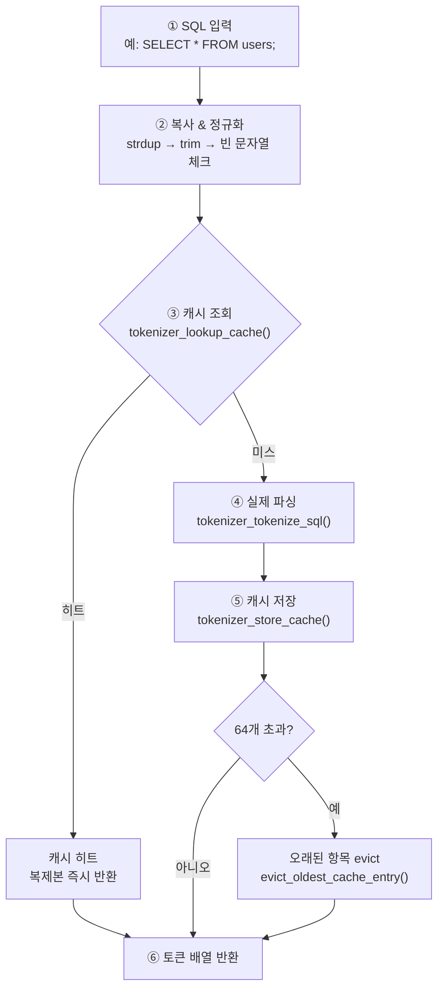
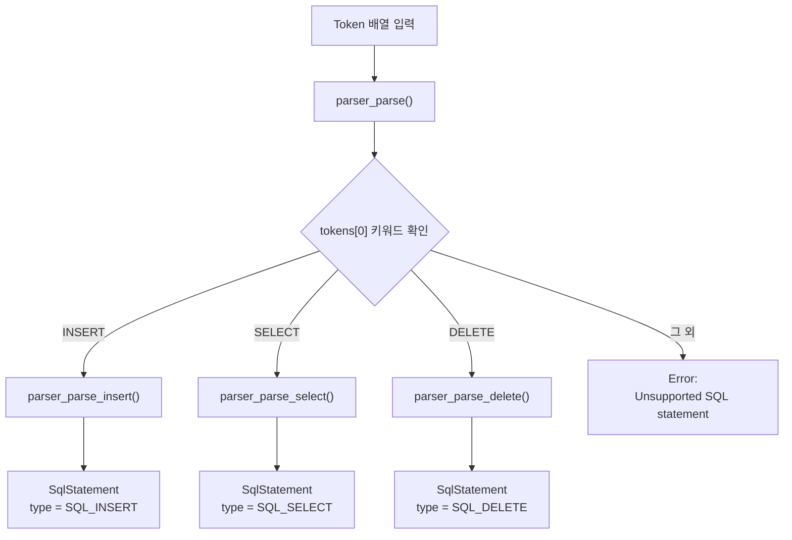
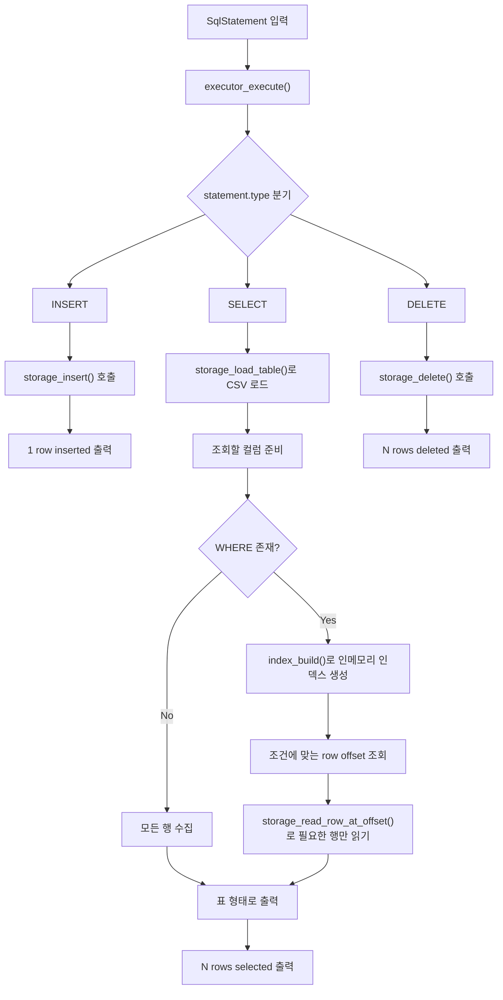

## 프로젝트 개요
> 이 프로젝트는 C 언어로 구현한 간단한 SQL 처리기(SQL Processor)입니다. </br>
> 사용자로부터 SQL 쿼리를 입력받아 파싱하고, 이를 실행하여 CSV 파일 기반 저장소에 반영합니다.
---
## 무엇을 만들었나
이번 과제의 목표는 SQL 문자열을 받아 실제로 실행하는 엔진을 C로 직접 구현하는 것이었습니다.
- `SELECT`, `INSERT`, `DELETE` 세 가지 SQL 문을 지원합니다.
- 파일 모드(.sql 파일 실행)와 REPL 모드(대화형 셸) 두 가지 방식으로 동작합니다.
- 데이터는 CSV 파일에 저장되고, WHERE 조건을 포함한 조회와 삭제도 지원합니다.
- 파싱 비용을 줄이기 위해 tokenizer 내부에 LRU 방식의 캐시를 사용합니다.
- 동일한 SQL 문이 반복 입력되면 캐시에서 토큰 배열을 즉시 반환합니다.
---
## 모듈별 역할
| 모듈 | 역할 | 핵심 함수 |
|------|------|-----------|
| `src/tokenizer.c` | SQL 문자열을 `Token[]` 배열로 분해 | `tokenizer_tokenize()` |
| `src/parser.c` | 토큰 배열을 `SqlStatement` 구조체로 변환 | `parser_parse()` |
| `src/executor.c` | 파싱된 문장을 실행하고 결과 출력 | `executor_execute()` |
| `src/storage.c` | CSV 읽기/쓰기, 스키마 유지, 삭제 재작성 | `storage_insert()`, `storage_load_table()`, `storage_delete()` |
| `src/index.c` | 조건 조회를 위한 인메모리 인덱스 생성 | `index_build()`, `index_query_equals()`, `index_query_range()` |
| `src/utils.c` | 문자열/메모리/출력/세미콜론 탐지 유틸리티 | `utils_strdup()`, `utils_trim()`, `utils_compare_values()` |
---
## 단계별 시각화

## 전체 토크나이저 흐름 (tokenizer_tokenize 함수)


# Parser (구문 분석)

Tokenizer가 만든 `Token[]` 배열을 문법 규칙에 따라 소비하여 `SqlStatement` 구조체로 변환한다.

## 진입점: parser_parse()



## 실행 엔진

아래 다이어그램은 `executor.c`가 파싱된 SQL 문을 받아
`INSERT`, `SELECT`, `DELETE`를 어떻게 실행하는지 보여준다.



## Docker 실행

프로젝트 루트 디렉터리에서 아래 명령으로 이미지를 빌드하고 실행합니다.

```bash
docker build -t sql-processor .
docker run -it sql-processor bash -lc "make && ./sql_processor"
```

## 데모 시나리오

아래 SQL은 발표에서 사용한 시연 예시이다.  
초기 점심 데이터가 저장된 상태에서 저녁 메뉴를 추가하고, 조회와 삭제가 어떻게 동작하는지 보여준다.

```sql
SELECT * FROM jungle_menu;

INSERT INTO jungle_menu (slot_key, menu_date, meal_type, dish_order, dish_name) VALUES ('20260409_dinner', 20260409, 'dinner', 1, '나가사끼짬뽕');
INSERT INTO jungle_menu (slot_key, menu_date, meal_type, dish_order, dish_name) VALUES ('20260409_dinner', 20260409, 'dinner', 2, '잡곡밥');
INSERT INTO jungle_menu (slot_key, menu_date, meal_type, dish_order, dish_name) VALUES ('20260409_dinner', 20260409, 'dinner', 3, '나초깐풍기');
INSERT INTO jungle_menu (slot_key, menu_date, meal_type, dish_order, dish_name) VALUES ('20260409_dinner', 20260409, 'dinner', 4, '락교무침');
INSERT INTO jungle_menu (slot_key, menu_date, meal_type, dish_order, dish_name) VALUES ('20260409_dinner', 20260409, 'dinner', 5, '배추김치');

SELECT dish_order, dish_name FROM jungle_menu WHERE slot_key = '20260409_lunch';
SELECT dish_order, dish_name FROM jungle_menu WHERE slot_key = '20260409_dinner';

SELECT menu_date, meal_type FROM jungle_menu WHERE dish_name = '깍두기';

DELETE FROM jungle_menu WHERE slot_key = '20260409_dinner';

SELECT dish_order, dish_name FROM jungle_menu WHERE slot_key = '20260409_dinner';

exit
```

## 테스트

테스트는 네 단계로 나눴다.

| 분류 | 목적 |
| --- | --- |
| Unit Test | 토크나이저, 파서, 스토리지, 실행기 같은 모듈 단위 검증 |
| Integration Test | tokenizer -> parser -> executor -> storage가 연결돼서 잘 동작하는지 확인 |
| Functional Test | INSERT, SELECT, DELETE, WHERE 같은 실제 SQL 기능 검증 |
| Edge Case Test | 중복 PK, 문자열 내 수미표, 존재하지 않는 테이블, 빈 결과 같은 예외 상황 검증  |


## 수요 코딩회 작업 비중


## 최적화 요약

| 항목 |  설명 |
|------|----------|
| Tokenizer 캐시 | 동일 SQL 입력 시, 토큰화 결과를 캐시에서 재사용하여 문자열 → 토큰 변환 비용 감소 |
| 인덱스 기반 조회 | WHERE 조건 시, 인메모리 인덱스를 생성하여 조건에 맞는 row offset 탐색 |
| Offset 기반 파일 접근 | 전체 파일을 순회하지 않고, 필요한 행만 직접 읽어서 조회 |
---

# B+ Tree 인덱스 개발 작업 로그

이 섹션은 이번 과제에서 AI 에이전트가 어떤 순서로 무엇을 바꿨는지 추적하기 위한 기록이다.
기존 SQL Processor 구조는 유지하고, player 전적 테이블에 필요한 `id`, `game_win_count` B+ 트리 인덱스를 추가하는 것을 목표로 했다.

## 프로젝트 개요

이 프로젝트는 C 언어 기반 SQL Processor다.
SQL 문자열을 tokenizer와 parser가 해석하고, executor가 storage 계층을 통해 CSV 파일에 데이터를 저장하거나 조회한다.

기본 실행 흐름:

```text
SQL 입력 -> tokenizer -> parser -> executor -> storage(CSV)
```

## 이번 과제 목표

- player 전적 테이블 스키마를 기준으로 동작한다.
- `id`는 INSERT 시 자동으로 부여한다.
- `WHERE id = ?` 조건은 B+ 트리 인덱스를 사용한다.
- `WHERE game_win_count = ?` 조건은 B+ 트리 인덱스를 사용한다.
- 그 외 조건은 기존처럼 선형 탐색한다.
- 1,000,000건 이상 데이터에서 선형 탐색과 인덱스 탐색 성능을 비교한다.

## 플레이어 전적 테이블 스키마

```csv
id,nickname,game_win_count,game_loss_count,total_game_count
```

- `id`: 자동 증가 정수 PK
- `nickname`: 플레이어 닉네임
- `game_win_count`: 승리 횟수
- `game_loss_count`: 패배 횟수
- `total_game_count`: 전체 게임 수, 항상 `game_win_count + game_loss_count`

## B+ 트리 설계 요약

이번 구현은 범용 DB 인덱스가 아니라 과제에 맞춘 고정 2컬럼 인덱스다.

```text
id_tree:
  key   = id
  value = RowRef(offset)

win_tree:
  key   = game_win_count
  value = OffsetList(offset 여러 개)
```

`id`는 중복되지 않기 때문에 하나의 key가 하나의 row offset만 가진다.
`game_win_count`는 같은 승리 횟수를 가진 row가 여러 개 있을 수 있으므로 offset list를 value로 둔다.

## 실행 계획 분기 기준

```text
WHERE id = 숫자
-> BPTREE_ID_LOOKUP

WHERE game_win_count = 숫자
-> BPTREE_WIN_LOOKUP

WHERE nickname = 값
WHERE game_loss_count = 값
WHERE total_game_count = 값
그 외 조건
-> LINEAR_SCAN
```

SQL 문법은 새로 추가하지 않았다.
executor가 기존 `WHERE column op value` 구조를 보고 내부 실행 계획만 선택한다.

## auto id 관리 방식

기존 방식처럼 다음 id를 구하려고 매번 CSV 전체를 훑으면 대용량 INSERT에서 너무 느리다.
그래서 `data/<table>.meta` 파일에 다음에 사용할 id인 `next_id`를 저장한다.

동작 방식:

1. INSERT 시 meta 파일에서 `next_id`를 읽는다.
2. 이번 row의 `id`로 사용한다.
3. INSERT 성공 후 `next_id + 1`을 meta 파일에 저장한다.
4. meta 파일이 없으면 CSV를 한 번만 스캔해서 복구한다.

## benchmark 방법

```bash
make benchmark
```

benchmark는 `data/players.csv`에 대량 데이터를 만들고 아래를 비교한다.

- `WHERE id = ?` 선형 탐색 vs B+ 트리 탐색
- `WHERE game_win_count = ?` 선형 탐색 vs B+ 트리 탐색

성능 비교에서는 결과 출력 시간을 제외하기 위해 silent mode를 사용한다.

## 테스트 방법

```bash
make tests
```

추가된 테스트:

- `tests/test_bptree.c`: B+ 트리 삽입/검색/split/duplicate 검증
- `tests/test_index.c`: `id`, `game_win_count` index manager 검증
- `tests/test_executor.c`: executor 실행 계획 분기 검증
- `tests/test_cases/player_bptree.sql`: SQL 통합 흐름 확인

## AI 작업 로그

### Step 1. base 코드 분석

- 목표: 기존 SQL 처리 흐름과 storage/index/executor 역할 확인
- 변경한 파일: 없음
- 이유: 기존 구조를 깨지 않고 B+ 트리만 끼워 넣기 위해서
- 핵심 확인 내용: `SQL -> tokenizer -> parser -> executor -> storage` 흐름, CSV row offset 기반 읽기 가능성
- 검증 방법: 파일 구조와 함수 역할 확인
- 결과: B+ 트리 코어는 새 파일로 분리하고, `index.c`는 manager 역할로 두는 방향 결정
- 남은 이슈: 기존 README 일부 글자 깨짐은 별도 복구하지 않음

### Step 2. B+ 트리 자료구조 추가

- 목표: `id`, `game_win_count` 인덱스가 공통으로 쓸 수 있는 B+ 트리 코어 작성
- 변경한 파일: `src/bptree.h`, `src/bptree.c`
- 이유: 기존 인메모리 인덱스 대신 과제 요구사항의 B+ 트리 탐색을 제공하기 위해서
- 핵심 구현 내용: create, search, insert, leaf split, internal split, destroy
- 검증 방법: `tests/test_bptree.c`
- 결과: 중복 key를 거부하는 unique-key B+ 트리 코어 추가
- 남은 이슈: delete/rebalance는 기본 구현 범위에서 제외

### Step 3. storage auto id 개선

- 목표: INSERT 시 `id` 자동 부여와 `next_id` meta 파일 관리
- 변경한 파일: `src/storage.h`, `src/storage.c`
- 이유: 1,000,000건 INSERT에서 매번 CSV 전체를 스캔하지 않기 위해서
- 핵심 구현 내용: `StorageInsertResult`, `storage_insert_with_result`, player schema 고정, `total_game_count` 자동 계산
- 검증 방법: storage/executor 테스트와 SQL 통합 테스트
- 결과: INSERT 결과로 assigned id, win/loss/total, file offset을 받을 수 있게 됨
- 남은 이슈: 기존 일반 INSERT 호환성은 wrapper로 유지

### Step 4. 2개 인덱스 연동

- 목표: `id`, `game_win_count` B+ 트리를 executor와 연결
- 변경한 파일: `src/index.h`, `src/index.c`, `src/executor.h`, `src/executor.c`
- 이유: `WHERE id = ?`, `WHERE game_win_count = ?`에서 B+ 트리 경로를 사용하기 위해서
- 핵심 구현 내용: `PlayerIndexSet`, `RowRef`, `OffsetList`, 실행 계획 enum, index cache
- 검증 방법: `tests/test_index.c`, `tests/test_executor.c`
- 결과: `id`는 단건 offset, `game_win_count`는 offset list로 조회 가능
- 남은 이슈: INSERT 후에는 단순화를 위해 index cache를 무효화하고 다음 조회 때 다시 build

### Step 5. 테스트 추가/수정

- 목표: 핵심 함수와 실행 경로를 단위 테스트로 확인
- 변경한 파일: `tests/test_bptree.c`, `tests/test_index.c`, `tests/test_executor.c`, `tests/run_tests.sh`, `tests/test_cases/player_bptree.sql`
- 이유: 구현 결과가 설명 가능한 코드인지 검증하기 위해서
- 핵심 구현 내용: B+ 트리, index manager, executor plan, SQL integration test
- 검증 방법: `make tests`
- 결과: 테스트 실행 대상으로 새 테스트 추가
- 남은 이슈: benchmark는 시간이 오래 걸리므로 일반 unit test와 분리

### Step 6. benchmark 추가

- 목표: 대량 row에서 선형 탐색과 B+ 트리 탐색의 속도 차이 확인
- 변경한 파일: `tests/benchmark_bptree.c`, `Makefile`
- 이유: 발표에서 같은 조건, 같은 결과 개수, 다른 실행 경로를 보여주기 위해서
- 핵심 구현 내용: 1,000,000건 player CSV 생성, forced linear/index mode 비교, 평균 시간 출력
- 검증 방법: `make benchmark`
- 결과: benchmark 전용 실행 파일 빌드 타깃 추가
- 남은 이슈: 실행 시간은 PC 환경에 따라 달라질 수 있음

### Step 7. 최종 검증 및 결과 정리

- 목표: 개발 내용을 초보자도 이해할 수 있게 문서화
- 변경한 파일: `README.md`, `develop.md`
- 이유: 팀원이 AI가 무엇을 왜 바꿨는지 빠르게 이해해야 하기 때문
- 핵심 구현 내용: 구현 흐름, offset/index 관계, B+ 트리 역할, 테스트/benchmark 방법 정리
- 검증 방법: Docker 이미지 `jungle-c-dev`에서 `make tests`, `make benchmark ARGS="10000 10"` 실행
- 결과: 전체 테스트 14 passed, 0 failed. 작은 benchmark 샘플 정상 실행
- 남은 이슈: 기본 1,000,000건 benchmark 수치는 발표 전 실제 실행 후 결과 섹션에 갱신 필요

## 최종 benchmark 결과

개발 중 빠른 검증으로 아래 명령을 실행했다.

```bash
make benchmark ARGS="10000 10"
```

샘플 결과:

- rows: 10,000
- queries: 10
- `WHERE game_win_count = 85000`
  - linear scan average: 0.601900 ms
  - B+ tree average: 0.310400 ms
  - speedup: 1.94x
- `WHERE id = 5000`
  - linear scan average: 0.632500 ms
  - B+ tree average: 0.259800 ms
  - speedup: 2.43x

기본 과제 기준인 1,000,000건 benchmark는 발표 전 아래 명령으로 다시 실행해 이 섹션을 갱신한다.

```bash
make benchmark
```
